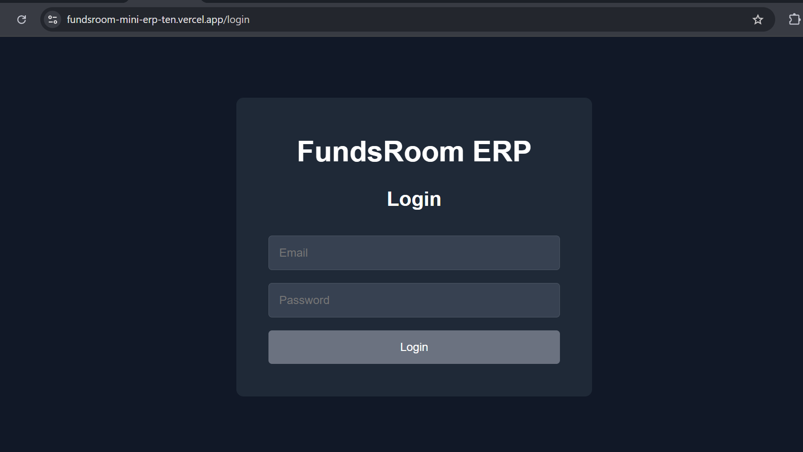
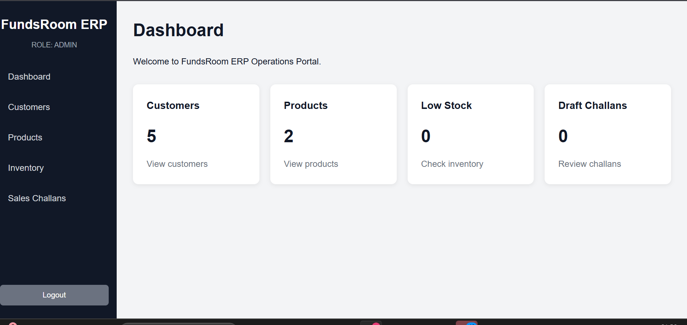
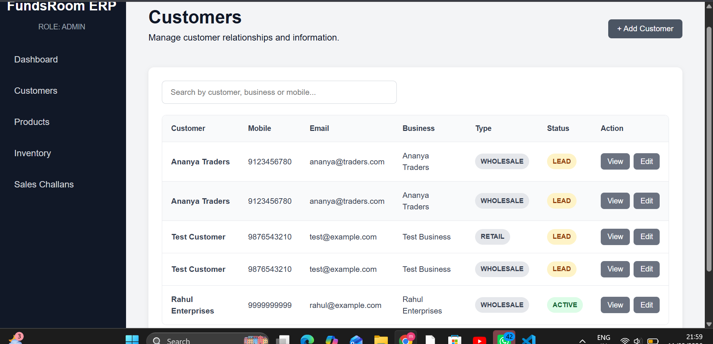
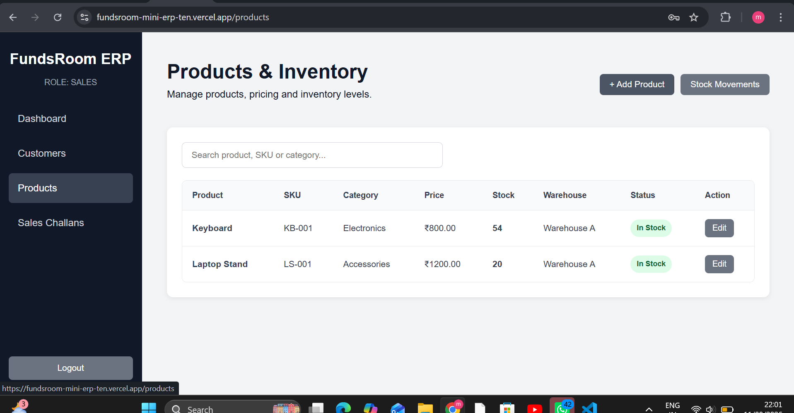
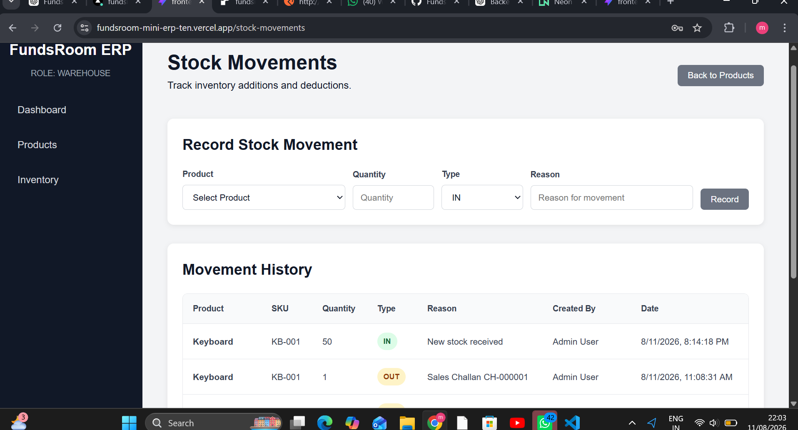
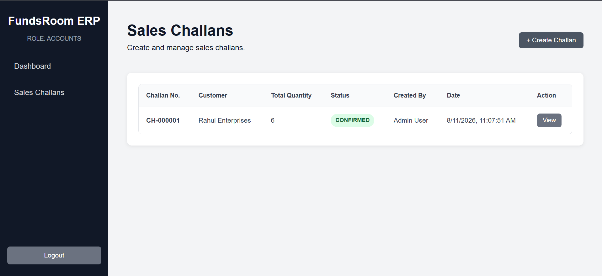

# Fundsroom Mini ERP + CRM

A full-stack Mini ERP + CRM Operations Portal developed as part of the Fundsroom Full Stack Developer Technical Case Study.

The application provides role-based access for managing customers, products, inventory, and sales challans through a responsive web interface.

## Live Demo

**Frontend:**  
https://fundsroom-mini-erp-ten.vercel.app

**Backend API:**  
https://fundsroom-erp-backend-aqjw.onrender.com

---

## Tech Stack

### Frontend

- React
- TypeScript
- Vite
- Axios
- React Router

### Backend

- Node.js
- Express.js
- TypeScript
- JWT Authentication
- REST APIs

### Database

- PostgreSQL
- Prisma ORM
- Neon PostgreSQL

### Deployment

- Frontend: Vercel
- Backend: Render
- Database: Neon

---

## User Roles

The application implements role-based access control with the following roles:

- **Admin**
- **Sales**
- **Warehouse**
- **Accounts**

Authentication is handled using JWT tokens.

---

## Modules

### 1. Authentication & Role Management

- User login
- JWT-based authentication
- Role-based access control
- Protected routes
- Role-specific application access

### 2. Customer CRM

- Add customers
- View customers
- View customer details
- Edit customer information
- Customer types:
  - Retail
  - Wholesale
  - Distributor
- Customer information includes:
  - Name
  - Mobile
  - Email
  - Business Name
  - GST Number
  - Address

### 3. Product Management

- Add products
- View products
- Edit product information
- Product and inventory details

### 4. Inventory Management

- Track product stock
- Monitor available quantities
- Identify low-stock products

### 5. Sales Challan Management

- Create sales challans
- Manage challan records
- View challan details
- Track draft challans

---

## Dashboard

The dashboard provides an overview of important operational information including:

- Total Customers
- Total Products
- Low Stock Items
- Draft Sales Challans

---

## Screenshots

### Login



### Dashboard



### Customers



### Products



### Inventory



### Sales Challans



---

## Project Structure

```text
Fundsroom-Mini-ERP/
│
├── frontend/
│   ├── src/
│   │   ├── components/
│   │   ├── pages/
│   │   ├── services/
│   │   ├── types/
│   │   └── ...
│   ├── public/
│   └── package.json
│
├── backend/
│   ├── src/
│   │   ├── routes/
│   │   ├── controllers/
│   │   ├── middleware/
│   │   ├── services/
│   │   └── ...
│   ├── prisma/
│   └── package.json
│
├── screenshots/
│   ├── Login.png
│   ├── dashboard.png
│   ├── customers.png
│   ├── products.png
│   ├── inventory.png
│   └── sales-challans.png
│
└── README.md